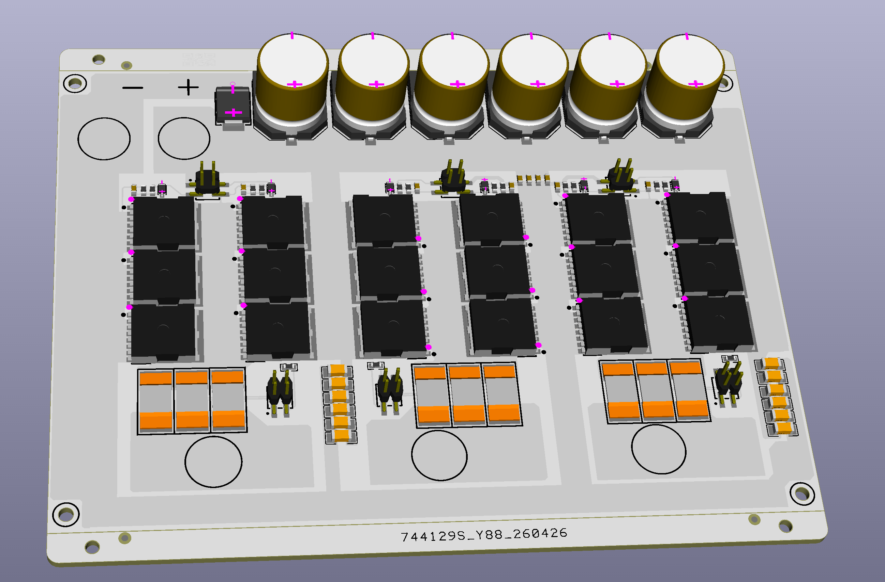
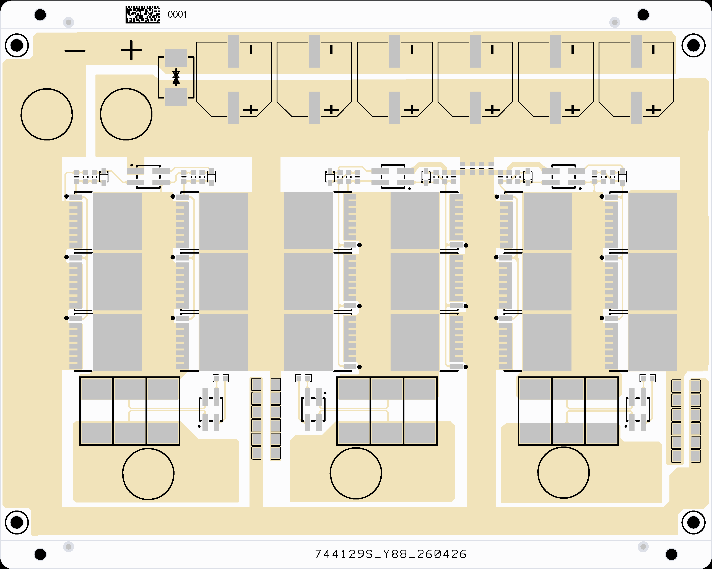
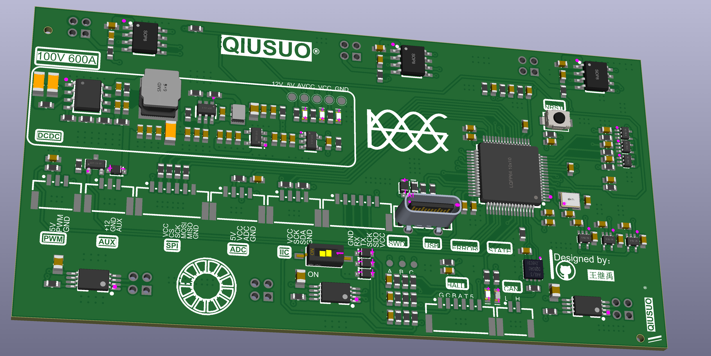

# high-power GaN FOC - 高性能磁场定向控制库 

> *「纯 C 语言。几行配置。你的电机丝滑运转。」*
> *"Pure C. A few lines of config. Your motor spins like silk."*

[](https://github.com/Sguan-ZhouQing/SguanFOC_Library)
[](LICENSE)
[](https://en.wikipedia.org/wiki/C_(programming_language))
[](https://github.com/Sguan-ZhouQing/SguanFOC_Library)
[](https://github.com/Sguan-ZhouQing/SguanFOC_Library)
[**English**](https://github.com/Sguan-ZhouQing/SguanFOC_Library/blob/main/%E9%85%8D%E5%A5%97QT%E4%B8%8A%E4%BD%8D%E6%9C%BA%E5%8F%8AFOC%E4%BD%BF%E7%94%A8%E8%AF%B4%E6%98%8E%E2%91%A0%5BPDF%5D/README_EN.md) | [**中文**](https://github.com/Sguan-ZhouQing/SguanFOC_Library/blob/main/README.md)

<br>

**在你的 MCU 里跑一套完整 FOC，从坐标变换到 SVPWM，从有感到无感。**

<br>

5分钟初始化，你能让一台无刷电机转起来——有感、无感、霍尔，任你选。从 **有感三环FOC** 到 **HFI高频注入 + 高速域无感观测**，全速域覆盖。不是「能转就行」的那种水平——是伺服级响应、工业级稳定。

**你看到的每一个控制算法，都在真实硬件上跑通过。** 不是论文仿真，不是概念验证，就是 C语言 + MCU !


<p align="center"><sub>
  ▲ 【代码框架图例->SguanFOC库文件包含关系】
  👉 <a href="https://www.bilibili.com/video/BV16CQcBYEsf/?spm_id_from=333.1387.homepage.video_card.click">观看GaNFOC最新移植视频（哔哩哔哩）</a>
</sub></p>

> 📣 **MIT 协议开源。** 个人和商用都免费，无需授权。跨平台通用...ARM、DSP、任何支持C语言的 MCU𒁈 都能用!


## 1.简单开始 Start 🚀

> *「引入头文件。填好接口。你的电机闭环转动。」*
> *"Include the header. Implement the hooks. Motor closes loop."*

```c
#include "SguanFOC.h"

int main(void) {
    MCU_Init();                      // 你的MCU平台 + 外设初始化
    while(1) {
        SguanFOC_main_Loop();        // ①初始化 + 串口数据收发
    }
}

void TIM1_IRQHandler(void) {
    SguanFOC_High_Loop();            // ②高频任务：电流环、角度计算、PWM 生成
    // 你的其他高优先级中断任务
}

void TIM2_IRQHandler(void) {
    SguanFOC_Low_Loop();             // ③低频任务：状态机切换、故障保护
    // 你的其他低优先级中断任务
}

void USART1_IRQHandler(void) {
    SguanFOC_Printf_Loop(Sguan_PrintfBuff, Size)； // ④串口调试：接收解析
    // 你的其他串口中断任务
}

// ⑤用户自定义：在UserData_*.h文件中依次填写好电机控制模式和运行参数

```

## 2.Star 趋势(^^)

> *「点个 Star。收藏项目。你的同行都在用。」*
> *"Hit the star. Bookmark it. Your peers are already using it."*

<a href="https://www.star-history.com/?repos=Sguan-ZhouQing%2FSguanFOC_Library&type=date&legend=top-left">
 <picture>
   <source media="(prefers-color-scheme: dark)" srcset="https://api.star-history.com/chart?repos=Sguan-ZhouQing/SguanFOC_Library&type=date&theme=dark&legend=top-left&sealed_token=DCNZHrFTcRWg8JwcxzJZ7Me5CysRVo28rEYaTqCv7jwAFsEV2JCu7urRkgF67jWIudWG1NzAXrsyGJAKMvDuN9xXhMSHM9Upuw94HtD1lZx1Cn9p5KdCiQ" />
   <source media="(prefers-color-scheme: light)" srcset="https://api.star-history.com/chart?repos=Sguan-ZhouQing/SguanFOC_Library&type=date&legend=top-left&sealed_token=DCNZHrFTcRWg8JwcxzJZ7Me5CysRVo28rEYaTqCv7jwAFsEV2JCu7urRkgF67jWIudWG1NzAXrsyGJAKMvDuN9xXhMSHM9Upuw94HtD1lZx1Cn9p5KdCiQ" />
   
 </picture>
</a>

## 3.📋版本路线图(库代码功能展示)

```
SguanFOC Library Evolution
═══════════════════════════════════════════════════════════════

SguanFOC库v3.0.0 ->
定位：有感FOC电机控制算法库  浮点运算
电机状态机  优化的数学运算  Justfloat串口协议
PLL锁相环速度跟踪  PID闭环控制  IMC内模思想
LADRC线自抗扰控制  MTPA最大转矩比控制  前馈解耦
巴特沃斯滤波器  printf重定向  用户接口提供

SguanFOC库v3.0.1 ->
定位：有感FOC电机控制算法库  Q31定点运算
电机状态机  优化的数学运算  Justfloat串口协议
PLL锁相环速度跟踪  PID闭环控制  IMC内模思想
STA二阶滑膜控制  MTPA最大转矩比控制  前馈解耦
巴特沃斯滤波器  printf重定向  用户接口提供

SguanFOC库v3.1.0 ->
定位：无感FOC电机控制算法库  浮点运算
电机状态机  优化的数学运算  Justfloat串口协议
HFI高频正弦波注入与转子位置估算 谐波抑制
SMO静止坐标系滑膜观测器算法 SVPWM与三次谐波注入的SPWM
NLFO非线性磁链观测器  霍尔模式  前馈解耦
DOB超螺旋滑模扰动观测器 弱磁控制 
抗齿槽算法 角度相位延迟补偿 死区补偿
NSD转子极性辨识  电机参数辨识 SMC滑模控制
PLL锁相环速度跟踪  PID闭环控制  STA超螺旋滑模控制
LADRC线自抗扰控制  MTPA最大转矩比控制 FW弱磁控制
三种典型二阶滤波器  printf重定向  用户接口提供
═══════════════════════════════════════════════════════════════
```
## 4.无感算法实物验证图示


```
* 上面内容是HFI高频正弦波注入切SMO滑模观测器
* 上面内容是HFI高频正弦波注入切NLFO非线性磁链观测器
* (图例为简单调参验证，深度调试后效果更好)
* (SguanFOC其余功能正常,参数辨识和极性辨识有缺陷,后面项目会得到修复)
```


---

## 5.控制模式一览

> *「一个宏定义。切换模式。你的电机适配任意场景。」*
> *"One macro. Switch modes. Motor adapts to any scenario."*

- 🎯 **19 种控制模式**：开环 → 有感 → 无感 → 全速域融合
- 🎛️ **4 种控制算法**：PID / LADRC / SMC / STA
- 🔬 **3 种无感观测器**：HFI / SMO / NLFO
- ⚡ **10+ 高级功能**：MTPA / 弱磁 / 谐波抑制 / 参数辨识 / 死区补偿...

| 编号 | 模式 | 说明 | 定位方式 | 适用场景 |
|:----:|:-----|:-----|:---------|:---------|
| **0** | `MODE_VF_OPENLOOP` | VF 压频比开环 | 无传感器 | 开环强拖，电机初步测试 |
| **1** | `MODE_IF_OPENLOOP` | IF 流频比开环 | 无传感器 | 开环强拖，电流限幅保护 |
| **2** | `MODE_Voltag_OPEN` | 电压开环 | 编码器 | 电压模式调试 |
| **3** | `MODE_Current_SINGLE` | 电流单闭环 | 编码器 | 力矩控制模式 |
| **4** | `MODE_VelCur_DOUBLE` | 速度-电流串级闭环 | 编码器 | 通用速度控制 |
| **5** | `MODE_PosVelCur_THREE` | 位置-速度-电流三环 | 编码器 | 伺服定位、精密控制 |
| **6** | `MODE_Sensor_Hall` | 有感霍尔_转速环 | 霍尔传感器 | 低成本速度控制 |
| **7** | `MODE_Sensorless_HFI` | 高频注入_转速环 | 无感 (HFI) | 零低速运行 |
| **8** | `MODE_Sensorless_SMO` | 滑模观测_转速环 | 无感 (SMO) | 中高速运行 |
| **9** | `MODE_Sensorless_NLFO` | 非线性磁链_转速环 | 无感 (NLFO) | 中高速运行 |
| **10** | `MODE_Sensorless_HS` | 高频滑模结合_转速环 | 无感 (HFI+SMO) | 全速域平滑切换 |
| **11** | `MODE_Sensorless_HN` | 高频磁链结合_转速环 | 无感 (HFI+NLFO) | 全速域平滑切换 |
| **12** | `MODE_Sensorless_AS` | 霍尔滑模结合_转速环 | 霍尔 + SMO | 全速域融合控制 |
| **13** | `MODE_Sensorless_AN` | 霍尔磁链结合_转速环 | 霍尔 + NLFO | 全速域融合控制 |
| **14** | `MODE_Debug_HFI` | HFI 测试_转速环 | 编码器（外载观测）| HFI 算法调试 |
| **15** | `MODE_Debug_SMO` | SMO 测试_转速环 | 编码器（外载观测）| SMO 算法调试 |
| **16** | `MODE_Debug_NLFO` | NLFO 测试_转速环 | 编码器（外载观测）| NLFO 算法调试 |
| **17** | `MODE_Debug_HS` | HFI 切 SMO_转速环 | 编码器（融合测试）| 观测器切换调试 |
| **18** | `MODE_Debug_HN` | HFI 切 NLFO_转速环 | 编码器（融合测试）| 观测器切换调试 |

在 `UserData_Config.h` 中修改宏定义：

```c
// 选择你需要的模式（0-18）
#define Define_Run_Mode 11   // 例如：全速域 HFI+NLFO 无感控制
```

| 你的需求 | 推荐模式 |
|:---------|:---------|
| 刚拿到电机，想快速转起来 | `0` 或 `1` (开环强拖) |
| 做绕线机力矩控制 | `3` (电流单闭环) |
| 做平衡车、轮毂电机 | `4` (速度-电流双闭环) |
| 做云台、机械臂、CNC、3D打印机 | `5` (位置-速度-电流三闭环) |
| 低成本项目（用霍尔传感器）| `6` (有感霍尔) |
| 无人机、高速风机（无传感器）| `11` (全速域 HFI+NLFO) |
| 算法研究、观测器调参 | `14` - `18` (Debug 模式) |

---

## 6.上官硬件开源

> *「原理图。PCB。你的硬件一步到位。」*
> *"Schematic. PCB. Your hardware runs out of the box."*

<div align="center"></div>
<div align="center"></div>
<div align="center"></div>
<div align="center"></div>

<div align="center"></div>
<div align="center"></div>
<div align="center"></div>

---

## 7.📁仓库结构

```
SguanFOC_Library/
├── SguanFOC.c/h                # 核心框架
├── Sguan_math.c/h              # 数学运算 + 坐标变换
├── Sguan_IQmath.c/h            # 定点库
├── Sguan_PID.c/h               # PID 控制器
├── Sguan_Ladrc.c/h             # LADRC 自抗扰
├── Sguan_SMC.c/h               # 滑模控制
├── Sguan_STA.c/h               # 超螺旋滑模
├── Sguan_PLL.c/h               # 锁相环
├── Sguan_Filter.c/h            # 巴特沃斯/切比雪夫/贝塞尔
├── Sguan_SVPWM.c/h             # SVPWM 调制
├── Sguan_SPWM.c/h              # SPWM + 三次谐波注入
├── Sguan_HFI.c/h               # 高频注入
├── Sguan_SMO.c/h               # 滑模观测器
├── Sguan_NLFO.c/h              # 非线性磁链观测器
├── Sguan_NSD.c/h               # 极性辨识
├── Sguan_DOB.c/h               # 扰动观测器
├── Sguan_Optimize.c/h          # MTPA/弱磁/死区/角度补偿
├── Sguan_Cogging.c/h           # 抗齿槽标定
├── Sguan_Identify.c/h          # 参数辨识
├── Sguan_printf.c/h            # JustFloat 通信
├── Sguan_MotorStatus.c/h       # 状态机
├── Sguan_Feedforward.c/h       # 前馈环节
├── Sguan_Hall.c/h              # 三霍尔信号处理
├── UserData_Config.h           # (用户)配置开关
├── UserData_Function.h         # (用户)硬件接口
├── UserData_Motor.h            # (用户)电机参数
├── UserData_Parameter.h        # (用户)控制器参数
├── UserData_Status.h           # (用户)状态机回调
└── UserData_UserControl.h      # (用户)指令处理
```

👉 [**完整 API 操作文档**](https://github.com/Sguan-ZhouQing/SguanFOC_Library/blob/main/%E9%85%8D%E5%A5%97QT%E4%B8%8A%E4%BD%8D%E6%9C%BA%E5%8F%8AFOC%E4%BD%BF%E7%94%A8%E8%AF%B4%E6%98%8E%E2%91%A0%5BPDF%5D/Sguan%E4%BD%BF%E7%94%A8%E8%AF%B4%E6%98%8E%E4%B9%A6.pdf)

---

## 8.License

本项目采用 **MIT 协议**开源。

你可以**自由使用、修改、分发**本代码库，**包括商业用途**——公司内部使用、客户项目交付、做成付费产品售卖，均无限制。无需事先授权，无需支付任何费用。

MIT 协议仅要求保留版权声明，不强制注明出处，但欢迎告知我们你的使用场景。

> 📄 详见 [LICENSE](LICENSE) 文件

---

## 9.Connect 源代码作者

嵌入式算法工程师、开源硬件爱好者、独立开发者。代表作：SguanFOC 开源项目（GitHub FOC 算法库）。全平台分享电机控制、嵌入式开发与开源硬件技术。

| 平台 | 账号 | 链接 |
|---|---|---|
| GitHub | 无机盐布条 | https://github.com/wujiyan004?tab=repositories |
| B 站 | 无机盐布条 | [https://space.bilibili.com/29345456?spm_id_from=333.337.0.0](https://space.bilibili.com/29345456?spm_id_from=333.337.0.0) |
| 邮箱 | 技术交流 | 506200990@qq.com |

技术咨询、项目合作 → 通过以上平台或邮箱联系即可。

<p align="center">
  <b>SguanFOC - 让电机控制更简单</b> 🚀
</p>

<p align="center">
  
</p>


